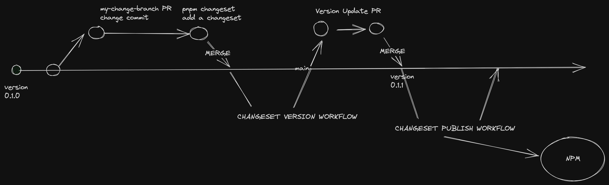

# Serial Number Reader Utility

This TypeScript utility provides functionality for detecting barcodes from an image file. It works primarily with browser-based applications and leverages the experimental BarcodeDetector API. Please note that this API is not universally supported across all browsers.

# Install

```
$: npm i serial-number-reader
```

## Demo

```bash
$ cd example
$ python3 -m http.server

# navigation to http://localhost:8000
```

## Usage TLDR

```typescript
import { readImageFile, detectSerialNumbers } from "serial-number-reader";

// example usage with file input
function getFileFromInputEvent(event: Event): File | null {
  return (<HTMLInputElement>event.target)?.files?.[0] || null;
}

async function handleFileInputChange(event: Event): Promise<void> {
  const file = getFileFromInputEvent(event);
  if (!file) {
    console.error("No file chosen");
    return;
  }

  try {
    const image = await readImageFile(file);
    const serialNumbers = await detectSerialNumbers(image);
    console.log(serialNumbers);

    // do something with image
  } catch (error) {
    console.error("Error reading file", error);
  }
}

const fileInputElement = document.querySelector('input[type="file"]');
fileInputElement.addEventListener("change", handleFileInputChange);
```

<image src="./barcode-scanner.png" />

## Features

This utility includes the following features:

1. **Barcode Interface:** A TypeScript interface `Barcode` representing a barcode with a raw value.

2. **BarcodeDetector Class:** A wrapper around the experimental `BarcodeDetector` API, providing a `detect` method that takes an `ImageBitmapSource` and returns a Promise of an array of `Barcode`.

3. **Image File Reader:** An async function `readImageFile` that takes an event (usually from an input of type `file`), reads the file as a Blob, creates an Image object, and returns a Promise of `HTMLImageElement`.

4. **Barcode Detection from Image:** An async function `detectSerialNumber` that takes an `ImageBitmapSource` and returns a Promise of an array of serial numbers extracted from the detected barcodes in the image.

5. **File to Blob Converter:** A function `readFileAsBlob` that reads a `File` as an `ArrayBuffer`, then creates a `Blob` with the file type, and returns a Promise of the Blob.

6. **Barcode Detection Wrapper:** A function `detectBarcodes` that creates a new `BarcodeDetector` for a specified set of barcode formats, detects barcodes in the provided `ImageBitmapSource`, and returns a Promise of an array of detected `Barcode` objects.

In the `detectBarcodes` function, the `barcodeTypes` parameter defaults to `['code_39', 'codabar', 'ean_13']`, but you can specify other types if needed. It uses a defined type `BarcodeType` which allows for these specific values only: 'aztec', 'code_128', 'code_39', 'code_93', 'codabar', 'data_matrix', 'ean_13', 'ean_8', 'itf', 'pdf417', 'qr_code', 'upc_a', 'upc_e'.

```typescript
const barcodes = await detectBarcodes(image, ["ean_8", "code_128"]);
```

Please note that the Barcode Detector API is experimental and may not be supported on all browsers. Always check for the existence of `BarcodeDetector` in the global scope before usage.

## Dependencies

No external dependencies are required. This utility uses native browser APIs and TypeScript. However, please make sure you have TypeScript installed and configured properly.

## Browser Compatibility

Please refer to the [official documentation](https://developer.mozilla.org/en-US/docs/Web/API/Barcode_Detector_API) for the most current browser compatibility information. As of the last update, the API is supported on Chrome and Edge (desktop) only.

## CI/CD - Changesets

There is a [changelog](https://www.npmjs.com/package/@changesets/cli) release process implemented with [changesets/cli](https://www.npmjs.com/package/@changesets/cli) see [release.yml](.github/workflows/release.yml)
The workflow template is based off of [changesets/action](https://github.com/changesets/action)



## Contributions

If you encounter any issues or want to contribute, feel free to open an issue or a pull request.
Be sure to make a PR, and add a changeset using `pnpm changeset`

## License

This project is open source and available under the [MIT License](LICENSE).
